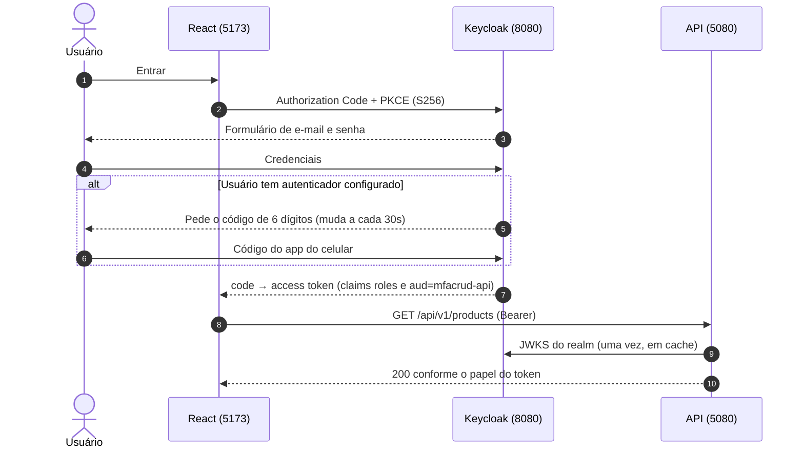
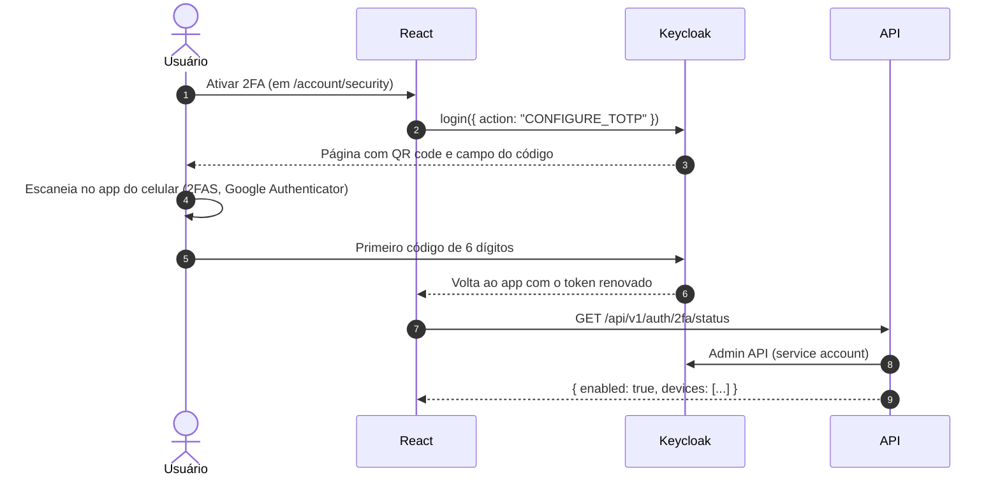

# MfaCrud

CRUD de produtos e usuários com papéis (`admin`, `staff`, `customer`) e **2FA TOTP opcional**, em que
toda a identidade fica no **Keycloak**: a API .NET 10 é um *resource server* puro — valida o token e
aplica autorização por papel, sem nunca emitir token, checar senha ou gerar QR code.

## Stack

| Camada | Escolha |
|---|---|
| Identidade | Keycloak 26.7.3 (realm importado de [`keycloak/realm-export.json`](keycloak/realm-export.json)) |
| API | .NET 10, Minimal APIs, EF Core + Npgsql, OpenAPI nativo |
| Banco | PostgreSQL 18 (bancos `mfacrud` e `keycloak`) |
| Front | React 19 + TypeScript + Vite, `keycloak-js` com PKCE S256 |
| Testes | xunit + Testcontainers (Postgres e Keycloak reais), Postman/newman |
| CI | GitHub Actions: build e testes .NET, lint e build do front, import do realm do zero, newman |

```
├── keycloak/           realm-export.json e como exportar de volta
├── db/init/            cria os bancos mfacrud e keycloak
├── src/MfaCrud.Api/    Auth, Keycloak (Admin API), Data, Models, Products, Users, Account
├── tests/              integração com Testcontainers + unitários
├── postman/            coleção (Manual PKCE e Automated) e environment local
└── web/                SPA React
```

## Como funciona o login



Ativar o segundo fator não passa pela API: o React chama a *Application Initiated Action* do próprio
Keycloak.



## Como rodar

Requisitos: Docker, .NET SDK 10 e Node 20+.

```bash
cp .env.example .env          # ajuste as senhas
docker compose up -d          # Postgres, Keycloak (realm importado) e a API em container
cd web && npm install && npm run dev
```

- Front: <http://localhost:5173>
- API: <http://localhost:5080> · health em `/health` · OpenAPI em `/openapi/v1.json`
- Keycloak: <http://localhost:8080> (admin do `.env`)

Para desenvolver a API fora do container (hot reload, debugger), suba só a infra e rode na máquina:

```bash
docker compose up -d db keycloak
dotnet user-secrets --project src/MfaCrud.Api \
  set "ConnectionStrings:Postgres" "Host=localhost;Port=5432;Database=mfacrud;Username=mfacrud;Password=<a do .env>"
dotnet user-secrets --project src/MfaCrud.Api \
  set "Keycloak:AdminClientSecret" "<MFACRUD_ADMIN_SVC_SECRET do .env>"
dotnet run --project src/MfaCrud.Api
```

As migrations rodam sozinhas no startup em Development. Para gerar novas:

```bash
dotnet tool restore
dotnet ef migrations add <Nome> --project src/MfaCrud.Api --output-dir Data/Migrations
```

### Usuários de teste

| Usuário | Senha | Papel | 2FA |
|---|---|---|---|
| `admin@test.local` | `Admin123!` | `admin` | não |
| `staff@test.local` | `Staff123!` | `staff` | não |
| `customer@test.local` | `Customer123!` | `customer` | não |
| `customer2fa@test.local` | `Customer123!` | `customer` | **sim**, já configurado |

São credenciais de desenvolvimento, válidas só no realm importado. Contas novas criadas pelo
formulário de registro do Keycloak nascem como `customer`.

## Como testar

```bash
dotnet test MfaCrud.sln
```

Sobe Postgres e Keycloak em containers descartáveis (Testcontainers) importando o mesmo
`realm-export.json`, pede tokens de verdade e exercita papéis, audience, issuer e o segundo fator.

```bash
npx newman run postman/MfaCrud.postman_collection.json \
  -e postman/local.postman_environment.json --folder Automated
```

Precisa da stack de pé. A pasta `Manual (PKCE)` é para rodar no app do Postman: ela abre o browser,
passa pela tela do Keycloak e tem no descritivo o roteiro de escanear o QR code no celular e entrar
de novo com o código.

## Decisões

**Keycloak em vez de autenticação própria.** Ganha-se login, cadastro, reset, política de senha,
brute force, 2FA TOTP com QR code, Account Console e OIDC padrão sem escrever nada disso — e o
segundo fator sai de graça, que é o ponto do projeto. Perde-se controle sobre as telas (o tema
padrão do Keycloak aparece no login) e adiciona-se um serviço a operar.

**Resource server puro.** A API não emite token, não valida senha, não gera QR nem valida TOTP. Isso
mantém a superfície de segurança concentrada no Keycloak e deixa a API sem nenhum código de
autenticação para revisar.

**Claim `roles` por mapper, não por transformação de claims.** Um *realm role mapper* nos clients
coloca as roles em um claim `roles` de primeiro nível, e o `RoleClaimType` do JwtBearer aponta para
ele. Assim `RequireRole("admin")` funciona direto, sem código para desembrulhar `realm_access.roles`.

**Direct grant só no client de dev.** `mfacrud-postman` tem *direct access grants* ligado porque
newman e os testes precisam de token sem browser. O client do front (`mfacrud-web`) tem o fluxo
desligado e só faz Authorization Code + PKCE.

**Admin API por service account com papéis mínimos.** `mfacrud-admin-svc` é confidencial, usa client
credentials e tem apenas `view-realm`, `view-users`, `query-users` e `manage-users` de
`realm-management`. O segredo vem de `.env`/user-secrets e entra no realm por placeholder.

**Sem tabela de usuários local.** `Product.CreatedById` guarda o `sub` do Keycloak sem chave
estrangeira. Não há espelho de usuários para sincronizar nem risco de divergir da fonte da verdade.

## Limitações e próximos passos

Fora de escopo desta versão:

- tema customizado do Keycloak (o login e a tela de OTP usam o tema padrão);
- WebAuthn/passkeys como segundo fator;
- SMTP, e portanto verificação de e-mail e recuperação de senha estão desligados;
- 2FA obrigatório para `admin` (seria um `OTP Form` condicionado a papel no browser flow);
- HTTPS: tudo roda em HTTP local, sem TLS nem proxy na frente;
- `ASPNETCORE_ENVIRONMENT=Development` também no container, que é o que aplica as migrations no
  startup e dispensa HTTPS no metadata do OIDC.

## Troubleshooting

**`401` com `The issuer ... is invalid` na API em container.** O browser fala com
`http://localhost:8080` e a API, dentro da rede do compose, com `http://keycloak:8080` — o `iss` do
token é sempre o primeiro. Por isso o Keycloak roda com `KC_HOSTNAME=http://localhost:8080` e
`KC_HOSTNAME_BACKCHANNEL_DYNAMIC=true`, e a API usa `Keycloak__Authority=http://keycloak:8080/...`
(metadata e JWKS) com `Keycloak__Issuer=http://localhost:8080/...` (o que se espera no token).

**`invalid_grant` no login do `customer2fa` mesmo com o código certo.** Ou o relógio da máquina está
fora de sincronia (TOTP tolera uma janela de 30s para cada lado), ou o código já foi usado: o realm
tem `otpPolicyCodeReusable: false`, então cada código vale uma vez. Os testes e o pre-request do
Postman esperam a próxima janela antes de gerar um novo.

**O navegador bloqueia a chamada do front com erro de CORS.** A origem precisa estar em
`Cors:AllowedOrigins` na API **e** em *Web origins* do client `mfacrud-web` no realm.

**`401` mesmo com token válido, e o token não tem `aud`.** Falta o *audience mapper* no client que
emitiu o token. Só `mfacrud-web` e `mfacrud-postman` têm o mapper que adiciona `mfacrud-api`; um
token tirado de outro client (`admin-cli`, por exemplo) é recusado — há um teste cobrindo isso.

**O import do realm falha ao recriar do zero.** Veja as armadilhas já mapeadas em
[`keycloak/README.md`](keycloak/README.md): roles built-in, `requiredActions` tudo-ou-nada e
`fullScopeAllowed` no service account.
